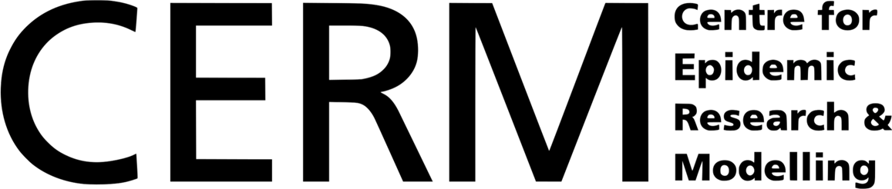

# Welcome {.unnumbered}

This short course teaches you how to code compartmental models in R using
[odin](https://mrc-ide.github.io/odin/). All models are written in odin's
modelling language and compiled to C, so odin is the only modelling package
you need.

## What you will learn

By the end of the session you will be able to:

- Write a compartmental model (SIR) in odin's language
- Compile, run and plot a model from R
- Change parameters and run scenarios
- Extend a model with a latent period (SEIR), births and deaths, and
  time-varying parameters

## Timetable (90 minutes)

| Time | Topic | Material |
|------|-------|----------|
| 0:00–0:50 | B3_1: odin basics & the SIR model | @sec-lecture1 |
| 0:50–1:30 | B3_2: extending models — SEIR, demography, time-varying parameters | @sec-lecture2 |

Slide decks for presenting:
[B3_1 slides](slides/slides-01-odin-basics-sir.html) ·
[B3_2 slides](slides/slides-02-extending-models.html)

Each lecture includes short exercises. Solutions are hidden in collapsible
blocks, so try the exercise before looking.

## Setup

You need R (≥ 4.1) and a working C compiler:

- **macOS**: install the Command Line Tools with `xcode-select --install`
- **Windows**: install [Rtools](https://cran.r-project.org/bin/windows/Rtools/)
- **Linux**: `gcc` is usually already present

Then install odin from CRAN:

```{r}
#| eval: false
install.packages("odin")
```

Check that odin can compile models on your machine (this compiles a small test
model, so it verifies your whole toolchain):

```{r}
#| eval: false
odin::can_compile()
#> [1] TRUE
```

All plotting in the course uses base R, so odin is the only package you need
to install.

## A note on odin versions

This course teaches odin version 1 (`install.packages("odin")`), the stable
release on CRAN. A rewrite, [odin2](https://mrc-ide.github.io/odin2/), is in
development and will eventually replace odin on CRAN. The modelling concepts
carry over directly; the main syntax differences are that odin2 uses
`parameter()` instead of `user()` and simulates through the companion package
`dust2`. Everything in this course runs on odin v1.

---

*Instructor: Swapnil Mishra (Asst. Professor)*

{height="100px"} {height="65px"} {height="65px"}
